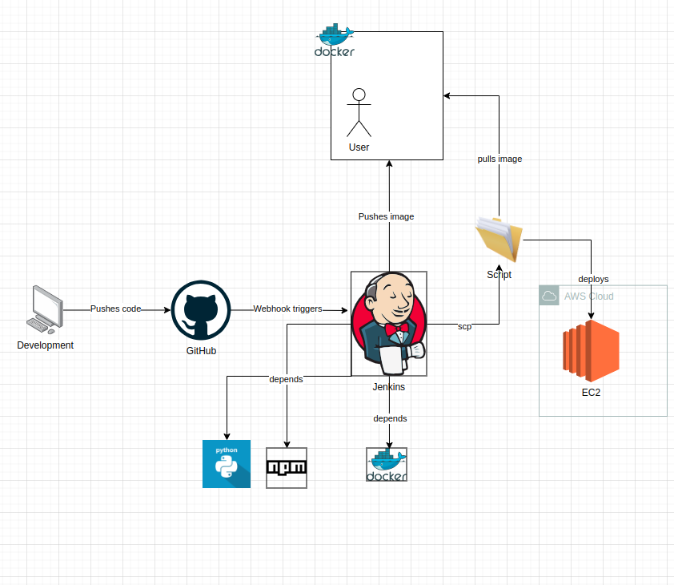

# Frontend for Roberta Sentiment Analysis Model

## Description
This project is a React based client for the Roberta Sentiment Analysis Model from Hugging Face's Transformers library.

## Requirements
- [**Node**](https://nodejs.org/en/download)
- [**Git**](https://git-scm.com/book/en/v2/Getting-Started-Installing-Git)
- [**Docker**](https://docs.docker.com/engine/install/) (Optional)

This project was bootstrapped with [Create React App](https://github.com/facebook/create-react-app).

## Architectural Design


**[Find Diagram Here](https://drive.google.com/file/d/1psvm3VLOt1IxM9xMuQPgKXG4NRLnYAkg/view?usp=sharing)**

## Set Up Locally
>Recommended to use a Bash terminal

**1. Clone the repository.**

```sh
git clone https://github.com/CalebAckom/roberta-sentiment-client.git
```

>Open the project in your IDE.

**2. Navigate to the main branch.**

```sh
git checkout main
```

**3. Create .env file from .env.example, and make the necessary changes**
```sh
cp .env.example .env
```

**4. Install packages.**

```sh
npm install
```

**5. Start the application.**

```sh
npm start
```

## Available Scripts

In the project directory, you can run:

### `npm start`

Runs the app in the development mode.\
Open [http://localhost:3000](http://localhost:3000) to view it in your browser.

The page will reload when you make changes.\
You may also see any lint errors in the console.

### `npm test`

Launches the test runner in the interactive watch mode.\
See the section about [running tests](https://facebook.github.io/create-react-app/docs/running-tests) for more information.

### `npm run build`

Builds the app for production to the `build` folder.\
It correctly bundles React in production mode and optimizes the build for the best performance.

The build is minified and the filenames include the hashes.\
Your app is ready to be deployed!

See the section about [deployment](https://facebook.github.io/create-react-app/docs/deployment) for more information.

## Running inside Docker

For working in this Setup, Docker is highly recommended. For more instructions on the Setup, follow [Official Docker Docs](https://docs.docker.com).

### Set Up

**1. Build your container:**

```sh
docker build -t <image-name> .
```

**2. Run the container:**

```sh
docker run -p 3000:3000 <image-name>
```

>You can change the host port to your preference

You can access the Service via localhost:

```sh
http://localhost:3000
```

## Learn More

You can learn more in the [Create React App documentation](https://facebook.github.io/create-react-app/docs/getting-started).

To learn React, check out the [React documentation](https://reactjs.org/).

### Code Splitting

This section has moved here: [https://facebook.github.io/create-react-app/docs/code-splitting](https://facebook.github.io/create-react-app/docs/code-splitting)

### Analyzing the Bundle Size

This section has moved here: [https://facebook.github.io/create-react-app/docs/analyzing-the-bundle-size](https://facebook.github.io/create-react-app/docs/analyzing-the-bundle-size)

### Making a Progressive Web App

This section has moved here: [https://facebook.github.io/create-react-app/docs/making-a-progressive-web-app](https://facebook.github.io/create-react-app/docs/making-a-progressive-web-app)

### Advanced Configuration

This section has moved here: [https://facebook.github.io/create-react-app/docs/advanced-configuration](https://facebook.github.io/create-react-app/docs/advanced-configuration)

### Deployment

This section has moved here: [https://facebook.github.io/create-react-app/docs/deployment](https://facebook.github.io/create-react-app/docs/deployment)

### `npm run build` fails to minify

This section has moved here: [https://facebook.github.io/create-react-app/docs/troubleshooting#npm-run-build-fails-to-minify](https://facebook.github.io/create-react-app/docs/troubleshooting#npm-run-build-fails-to-minify)

**Happy Coding!**
